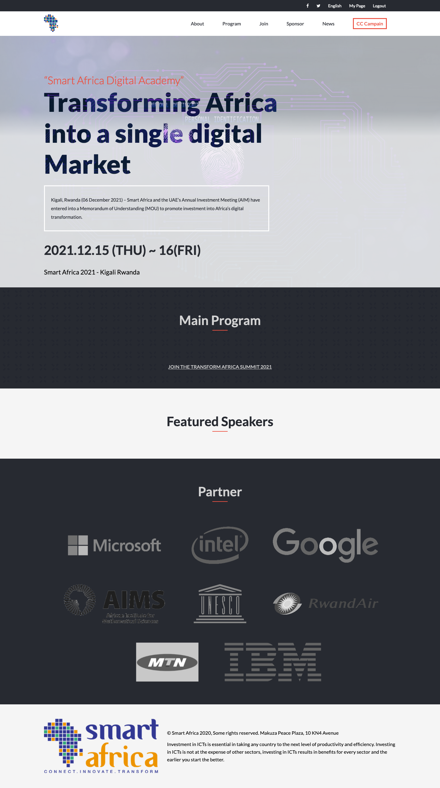

# My Portofolio
> The Summit aims to enable Africa to become more competitive, agile, open and innovative with the most favorable business climates that attract large-scale investments, reward entrepreneurship and enable fast growth and exports. For 2021, we're launching an unmissable hybrid edition.
\
> Kigali, Rwanda (06 December 2021) – Smart Africa and the UAE’s Annual Investment Meeting (AIM) have entered into a Memorandum of Understanding (MOU) to promote investment into Africa’s digital transformation.

## Built With

- HTML & CSS & JavaScript
- Html & Css linters

## Live Demo

### [LIVE DEMO LINK](https://aimemalaika.github.io/transform-afica/)

### [VIDEO DESCRIPTION](https://www.loom.com/share/bde04dcedcc1427c95608a6a2361876b)

## Getting Started
- clone the repository by running\
    `git clone https://github.com/aimemalaika/transform-afica`
- navigate to the folder\
    `cd transform-afica`

## Authors

👤 **Aime Malaika**

- GitHub: [@aimemalaika](https://github.com/aimemalaika)
- Twitter: [@Aime_malaika](https://twitter.com/Aime_Malaika)
- LinkedIn: [aimemalaika](https://linkedin.com/in/aimemalaika)

## 🤝 Contributing

Contributions, issues, and feature requests are welcome!

## Show your support

Give a ⭐️ if you like this project!

## Acknowledgments

- Original design idea by [Cindy Shin in Behance](https://www.behance.net/adagio07).

## 📝 License

This project is [MIT](./MIT.md) licensed.
